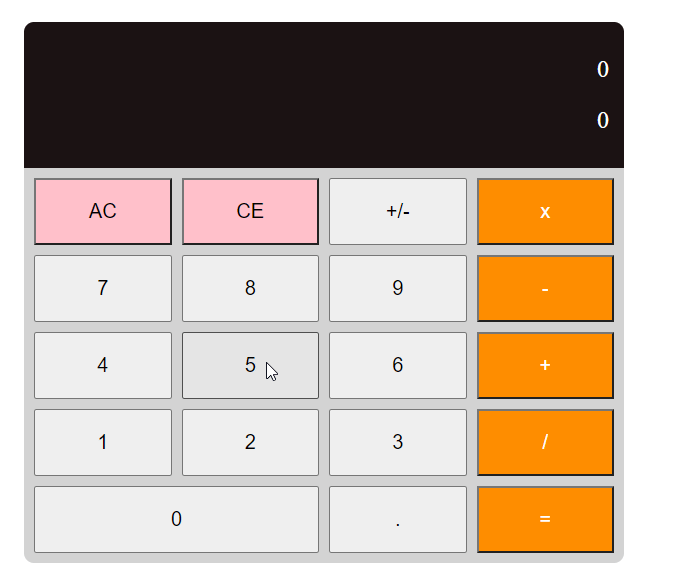

# vanilla-js-calculator

A simple way to write vanilla JS calculator using MVC design pattern (Model View Controller).
Written with as few styles and logic as possible

- Model is the "business logic" that handles calculations in the `.JS` file
- Controller is the javascript functions in the `.HTML` file
- View only renders the data in the `.JS` file

Written in a way similar to how single page applications like React,Vue, Angular etc are written

https://vincentntang.github.io/vanilla-js-calculator/

